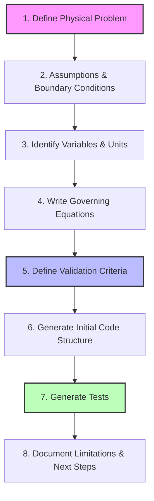
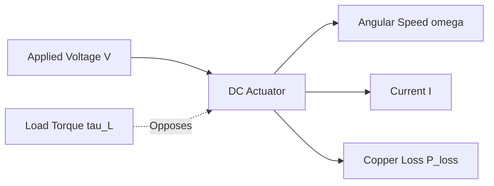

# PiCoding Core Workflow: Physical Assumptions to Executable Code

Physical systems operate under fundamental natural laws—such as conservation of energy, mass, and momentum—along with real-world engineering tolerances, boundary conditions, and design constraints. Traditional software development workflows often fail to bridge the gap between these physical assumptions and the software that models or controls them. This can lead to bugs like non-physical behaviors (e.g., negative temperatures, efficiencies > 100%), unit mismatches, or out-of-bounds inputs propagating silently.

The **PiCoding Core Workflow** provides a rigorous, 8-step structured process to translate a real-world physical problem into a robust AI coding task, complete with physical validation logic, defensive constraints, and boundary-aware test suites.

---

## The 8-Step Physical-to-Code Workflow



### Step 1: Define the Physical Problem
Describe the physical phenomenon, system, or component to be modeled or controlled. Define the system boundary (what is inside the model versus what is in the external environment) and state the core engineering goal (e.g., estimating thermal dissipation, path planning, power grid load, or control system stability).

### Step 2: List Assumptions and Boundary Conditions
All physical models are approximations of reality. Explicitly list the simplifying assumptions that make the problem computationally or analytically tractable.
* **Simplifying Assumptions:** Linearities, steady-state vs. transient dynamics, constant material properties, or neglecting secondary factors (like radiation, turbulence, or friction).
* **Boundary Conditions & Operating Regimes:** The environmental conditions under which the model is valid (e.g., temperature ranges, pressure bounds, or spatial constraints).

### Step 3: Identify Variables and Units
Compile a complete variables dictionary. For every variable, specify:
* **Symbol / Name:** Programmatic variable name.
* **Physical Dimension:** (e.g., Mass, Length, Time, Current).
* **SI Unit:** Explicit unit (e.g., `kg`, `m`, `s`, `A`, `rad/s`).
* **Direction:** Input, Parameter (constant for a given system), or Output.
* **Physical Bounds:** The mathematically or physically permissible range (e.g., mass > 0, absolute temperature > 0).

### Step 4: Write Governing Equations & Model Logic
State the mathematical equations representing the physics (e.g., differential equations, algebraic equations, state-transition rules).
* Include derivation or physical principles (Newton's laws, Maxwell's equations, thermodynamics).
* If equations require numerical solvers (e.g., Euler, Runge-Kutta), specify the solver criteria, step sizes, and stability considerations.
* Detail how special physical conditions (e.g., saturation, stasis, phase changes) alter the equations.

### Step 5: Define Validation Criteria
Specify programmatic validation rules that the implementation must enforce.
* **Input Validation:** Reject non-physical inputs (e.g., negative mass, absolute zero violations, NaN/Inf values).
* **Physical Invariants:** Conservation checks (e.g., $P_{\text{out}} \le P_{\text{in}}$), monotonicity (e.g., higher torque always decreases or maintains speed), or thermodynamic constraints.
* **Operational Limits:** Software warnings or error triggers when operating near safety limits (e.g., motor over-temperature, mechanical limits).

### Step 6: Generate Initial Code Structure
Design the software API based on the physical formulation.
* Use strongly-typed language features (e.g., Python dataclasses, type hinting).
* Structure variables as logical entities.
* Implement input assertions first.
* Return structured outputs that allow downstream code to inspect intermediate physical quantities (e.g., internal currents, power losses) for easier debugging.

### Step 7: Generate Tests
Design a comprehensive testing plan verifying both the software implementation and physical reality.
* **Normal Cases:** Test expected scenarios with analytical solutions.
* **Stall/Limit Cases:** Test physical extreme states (e.g., zero speed, infinite load, zero inputs).
* **Invariant & Conservation Tests:** Assert that conservation equations are not violated across random operational sweeps.
* **Invalid States:** Verify that entering non-physical parameter regimes raises descriptive, clean runtime errors.

### Step 8: Document Limitations and Next Steps
Clearly document what the model *cannot* do. This prevents developers from deploying the model outside its validity regime. Outline potential future improvements, such as adding non-linearities, dynamic states, or thermal coupling.

---

## End-to-End Concrete Example: Steady-State DC Actuator under Load

This example applies the 8-step workflow to a steady-state electromechanical DC motor driving a mechanical load—a core component in robotics (actuators), hardware systems (cooling fans), and positioning systems.



### 1. Define the Physical Problem
We model a permanent-magnet brush DC motor under a constant applied voltage ($V$) driving a constant mechanical torque load ($\tau_L$). The goal is to estimate the steady-state rotational speed ($\omega$), armature current ($I$), mechanical output power ($P_{\text{out}}$), electrical input power ($P_{\text{in}}$), and overall electromechanical efficiency ($\eta$).

### 2. Assumptions & Boundary Conditions
1. **Steady-State Regime:** We assume steady-state operation ($dI/dt = 0$ and $d\omega/dt = 0$). Rotor inertia ($J$) and winding inductance ($L$) are therefore ignored.
2. **Thermal Stability:** Winding resistance ($R$) is constant (assuming the system is thermally managed or operated briefly enough to prevent significant winding heat buildup).
3. **Linear Viscous Friction:** Internal motor mechanical losses are modeled as a linear viscous friction torque opposing motion ($B \cdot \omega$).
4. **Ideal Magnetic Circuits:** No magnetic core saturation occurs ($K_e$ and $K_t$ are constant).
5. **SI Consistency:** All variables are evaluated in coherent SI units.

### 3. Variables & Units

| Variable | Symbol | Dimension | SI Unit | Type | Physical Bounds | Description |
| :--- | :--- | :--- | :--- | :--- | :--- | :--- |
| `voltage` | $V$ | Voltage | $\text{V}$ | Input | $V \ge 0$ | Applied voltage across the armature |
| `resistance` | $R$ | Resistance | $\Omega$ | Parameter | $R > 0$ | Winding armature resistance |
| `back_emf_const` | $K_e$ | Voltage/Speed | $\text{V}\cdot\text{s}/\text{rad}$ | Parameter | $K_e > 0$ | Back-EMF constant |
| `torque_const` | $K_t$ | Torque/Current | $\text{N}\cdot\text{m}/\text{A}$ | Parameter | $K_t > 0$ | Motor torque constant (equals $K_e$ in SI) |
| `friction_coeff` | $B$ | Torque/Speed | $\text{N}\cdot\text{m}\cdot\text{s}/\text{rad}$ | Parameter | $B \ge 0$ | Viscous friction coefficient |
| `load_torque` | $\tau_L$ | Torque | $\text{N}\cdot\text{m}$ | Input | $\tau_L \ge 0$ | Opposing external load torque |
| `speed` | $\omega$ | Angular Speed | $\text{rad}/\text{s}$ | Output | $\omega \ge 0$ | Rotational angular speed |
| `current` | $I$ | Current | $\text{A}$ | Output | $I \ge 0$ | Winding current |
| `power_in` | $P_{\text{in}}$ | Power | $\text{W}$ | Output | $P_{\text{in}} \ge 0$ | Electrical power drawn by the motor |
| `power_out` | $P_{\text{out}}$ | Power | $\text{W}$ | Output | $P_{\text{out}} \ge 0$ | Net mechanical power delivered to load |
| `efficiency` | $\eta$ | Ratio | Dimensionless | Output | $0.0 \le \eta \le 1.0$ | Overall energy conversion efficiency |

### 4. Governing Equations

The steady-state electrical loop equation:
$$V = I \cdot R + K_e \cdot \omega$$

The steady-state mechanical torque balance:
$$\tau_m = K_t \cdot I = \tau_L + B \cdot \omega$$

Solving the electrical loop for current ($I$):
$$I = \frac{V - K_e \cdot \omega}{R}$$

Substituting $I$ into the torque balance:
$$K_t \left( \frac{V - K_e \cdot \omega}{R} \right) = \tau_L + B \cdot \omega$$

Solving for speed ($\omega$):
$$K_t \cdot V - K_t \cdot K_e \cdot \omega = R \cdot \tau_L + R \cdot B \cdot \omega$$
$$\omega (R \cdot B + K_t \cdot K_e) = K_t \cdot V - R \cdot \tau_L$$
$$\omega = \frac{K_t \cdot V - R \cdot \tau_L}{R \cdot B + K_t \cdot K_e}$$

#### Handling Stall Conditions
If the load torque is too high, the motor cannot rotate, leading to a **stall condition**. This occurs when the electromagnetic starting torque is less than or equal to the load torque:
$$K_t \cdot I_{\text{stall}} \le \tau_L \implies K_t \cdot \frac{V}{R} \le \tau_L \implies K_t \cdot V - R \cdot \tau_L \le 0$$

If this condition is met:
* Speed: $\omega = 0\text{ rad/s}$
* Current: $I = I_{\text{stall}} = \frac{V}{R}$
* Power Out: $P_{\text{out}} = 0\text{ W}$
* Efficiency: $\eta = 0.0$

Otherwise, if $K_t \cdot V - R \cdot \tau_L > 0$:
* Speed ($\omega$) is calculated using the solved algebraic equation.
* Current ($I$) is calculated as $\frac{V - K_e \cdot \omega}{R}$.
* Electrical Input Power: $P_{\text{in}} = V \cdot I$
* Net Mechanical Output Power (delivered to external load): $P_{\text{out}} = \tau_L \cdot \omega$
* Viscous friction loss power: $P_{\text{friction}} = B \cdot \omega^2$
* Armature resistive copper loss: $P_{\text{copper}} = I^2 \cdot R$
* Conservation check: $P_{\text{in}} = P_{\text{out}} + P_{\text{friction}} + P_{\text{copper}}$
* Mechanical Efficiency: $\eta = \frac{P_{\text{out}}}{P_{\text{in}}}$ (if $P_{\text{in}} > 0$, else $0$)

### 5. Validation Criteria

#### A. Input Parameter Violations (Strict Runtime Check)
* `voltage` ($V$) must be finite and $\ge 0$.
* `resistance` ($R$) must be finite and $> 0$.
* `back_emf_const` ($K_e$) and `torque_const` ($K_t$) must be finite and $> 0$.
* `friction_coeff` ($B$) must be finite and $\ge 0$.
* `load_torque` ($\tau_L$) must be finite and $\ge 0$.

#### B. Physical Invariants (Post-Computation Asserts)
* **Conservation of Energy:** Mechanical power output ($P_{\text{out}}$) plus losses ($P_{\text{friction}} + P_{\text{copper}}$) must equal electrical power input ($P_{\text{in}}$) within numeric floating-point tolerances ($10^{-5}\text{ W}$).
* **Efficiency Range:** $0.0 \le \eta \le 1.0$.
* **Speed Bounds:** Speed $\omega$ must never exceed the ideal no-load speed $\omega_0 = V / K_e$.
* **Current Bounds:** Current $I$ must never exceed the stall current $I_{\text{stall}} = V / R$.

---

### 6. Generate Initial Code Structure

Below is the structured, physics-validated implementation matching the design criteria.

```python
from dataclasses import dataclass
import math

@dataclass(frozen=True)
def MotorState:
    """Represents the steady-state operational characteristics of the DC Actuator."""
    speed_rad_s: float
    current_amp: float
    power_in_watt: float
    power_out_watt: float
    efficiency: float
    copper_loss_watt: float
    friction_loss_watt: float


def simulate_dc_motor_steady_state(
    voltage: float,
    resistance: float,
    back_emf_const: float,
    torque_const: float,
    friction_coeff: float,
    load_torque: float,
) -> MotorState:
    """Computes the steady-state performance of a permanent magnet DC motor.

    Args:
        voltage: Applied voltage (V) >= 0.0
        resistance: Armature winding resistance (Ohm) > 0.0
        back_emf_const: Back-EMF constant (V·s/rad) > 0.0
        torque_const: Torque constant (N·m/A) > 0.0
        friction_coeff: Viscous friction coefficient (N·m·s/rad) >= 0.0
        load_torque: Opposing mechanical load torque (N·m) >= 0.0

    Returns:
        MotorState containing the physical results of the simulation.

    Raises:
        ValueError: If any input is non-physical or mathematically invalid.
        AssertionError: If a physical conservation invariant is violated.
    """
    # Step 5A: Input Physical Validations
    if not all(math.isfinite(x) for x in [voltage, resistance, back_emf_const, torque_const, friction_coeff, load_torque]):
        raise ValueError("All inputs must be finite numeric values.")
    
    if voltage < 0.0:
        raise ValueError(f"Applied voltage must be non-negative. Got: {voltage} V")
    if resistance <= 0.0:
        raise ValueError(f"Armature winding resistance must be strictly positive. Got: {resistance} Ohm")
    if back_emf_const <= 0.0:
        raise ValueError(f"Back-EMF constant must be strictly positive. Got: {back_emf_const} V·s/rad")
    if torque_const <= 0.0:
        raise ValueError(f"Torque constant must be strictly positive. Got: {torque_const} N·m/A")
    if friction_coeff < 0.0:
        raise ValueError(f"Viscous friction coefficient must be non-negative. Got: {friction_coeff} N·m·s/rad")
    if load_torque < 0.0:
        raise ValueError(f"Load torque must be non-negative. Got: {load_torque} N·m")

    # Step 4: Evaluate Governing Equations
    # Check for stall: starting electromagnetic torque <= load torque
    # Starting torque at speed = 0 is T_start = torque_const * (voltage / resistance)
    starting_torque = torque_const * (voltage / resistance) if resistance > 0 else 0.0

    if starting_torque <= load_torque:
        # Motor is stalled
        speed = 0.0
        current = voltage / resistance
    else:
        # Motor rotates: solve speed equation
        numerator = (torque_const * voltage) - (resistance * load_torque)
        denominator = (resistance * friction_coeff) + (torque_const * back_emf_const)
        speed = numerator / denominator
        current = (voltage - (back_emf_const * speed)) / resistance

    # Power calculations
    power_in = voltage * current
    power_out = load_torque * speed
    copper_loss = (current ** 2) * resistance
    friction_loss = friction_coeff * (speed ** 2)

    # Efficiency calculations
    efficiency = (power_out / power_in) if power_in > 0.0 else 0.0

    # Step 5B: Post-Computation Physical Invariants
    # 1. Conservation of Energy check (P_in = P_out + P_losses)
    total_output_and_losses = power_out + copper_loss + friction_loss
    assert math.isclose(power_in, total_output_and_losses, abs_tol=1e-5), \
        f"Energy Conservation Violated! P_in: {power_in} W != Sum of power out and losses: {total_output_and_losses} W"
    
    # 2. Efficiency bounds
    assert 0.0 <= efficiency <= 1.00001, f"Physical impossible efficiency: {efficiency}"
    
    # 3. Speed bounds (cannot exceed theoretical ideal no-load speed V/K_e)
    no_load_speed = (voltage / back_emf_const) if back_emf_const > 0.0 else 0.0
    assert speed <= no_load_speed + 1e-6, f"Speed {speed} exceeds no-load limit {no_load_speed}"

    # 4. Current bounds (cannot exceed starting stall current V/R)
    stall_current = (voltage / resistance) if resistance > 0 else 0.0
    assert current <= stall_current + 1e-6, f"Current {current} exceeds stall limit {stall_current}"

    return MotorState(
        speed_rad_s=speed,
        current_amp=current,
        power_in_watt=power_in,
        power_out_watt=power_out,
        efficiency=min(efficiency, 1.0),
        copper_loss_watt=copper_loss,
        friction_loss_watt=friction_loss,
    )
```

---

### 7. Generate Tests

To ensure the model remains correct across future changes, implement physical assertion tests alongside standard engineering unit tests.

```python
import unittest
import math
from actuator import simulate_dc_motor_steady_state

class TestDCMotorSteadyState(unittest.TestCase):
    
    def setUp(self):
        # A common robotic actuator configuration
        self.voltage = 12.0          # V
        self.resistance = 1.5       # Ohm
        self.back_emf_const = 0.05   # V·s/rad
        self.torque_const = 0.05     # N·m/A (ideal SI: Kt = Ke)
        self.friction_coeff = 0.0001 # N·m·s/rad
        
    def test_no_load_operation(self):
        """Under zero external load torque, speed should approach no-load speed but be slightly lower due to friction."""
        state = simulate_dc_motor_steady_state(
            voltage=self.voltage,
            resistance=self.resistance,
            back_emf_const=self.back_emf_const,
            torque_const=self.torque_const,
            friction_coeff=self.friction_coeff,
            load_torque=0.0
        )
        ideal_no_load = self.voltage / self.back_emf_const # 12.0 / 0.05 = 240 rad/s
        self.assertLess(state.speed_rad_s, ideal_no_load)
        self.assertGreater(state.speed_rad_s, 200.0)
        self.assertGreater(state.current_amp, 0.0) # Drawing friction current
        self.assertEqual(state.power_out_watt, 0.0) # No load torque means no net work done
        self.assertEqual(state.efficiency, 0.0)

    def test_extreme_stall_torque(self):
        """If load torque exceeds maximum starting torque, motor must stall safely with speed=0 and full stall current."""
        # Stall torque = Kt * (V/R) = 0.05 * (12 / 1.5) = 0.4 N·m
        stall_torque = 0.4
        
        state = simulate_dc_motor_steady_state(
            voltage=self.voltage,
            resistance=self.resistance,
            back_emf_const=self.back_emf_const,
            torque_const=self.torque_const,
            friction_coeff=self.friction_coeff,
            load_torque=stall_torque
        )
        self.assertEqual(state.speed_rad_s, 0.0)
        self.assertEqual(state.current_amp, 12.0 / 1.5) # V / R = 8 A
        self.assertEqual(state.power_out_watt, 0.0)
        self.assertEqual(state.efficiency, 0.0)
        self.assertEqual(state.copper_loss_watt, 8.0**2 * 1.5) # I^2 * R = 96 W

    def test_invalid_negative_parameters(self):
        """Check that negative and infinite values are strictly rejected."""
        with self.assertRaises(ValueError):
            simulate_dc_motor_steady_state(-12.0, 1.5, 0.05, 0.05, 0.0001, 0.0)
        with self.assertRaises(ValueError):
            simulate_dc_motor_steady_state(12.0, -1.5, 0.05, 0.05, 0.0001, 0.0)
        with self.assertRaises(ValueError):
            simulate_dc_motor_steady_state(12.0, 1.5, float('nan'), 0.05, 0.0001, 0.0)

    def test_physical_conservation_sweeps(self):
        """Random parameter sweep asserting that energy conservation holds across all parameters."""
        import random
        for _ in range(50):
            v = random.uniform(1.0, 24.0)
            r = random.uniform(0.1, 10.0)
            ke = random.uniform(0.01, 0.5)
            kt = ke # Maintain ideal SI relation
            b = random.uniform(0.0, 0.001)
            tl = random.uniform(0.0, 1.5)
            
            # The simulator will automatically assert conservation internally
            # We verify it runs successfully
            try:
                simulate_dc_motor_steady_state(v, r, ke, kt, b, tl)
            except AssertionError as e:
                self.fail(f"Energy conservation assert failed during sweep: {e}")
```

### 8. Document Limitations and Next Steps
* **Thermal Coupling:** Winding resistance $R$ increases with temperature ($R(T) = R_0[1 + \alpha(T - T_0)]$). At high loads, this reduces starting torque and efficiency. *Next step: Integrate transient thermal ODE ($mc \frac{dT}{dt} = P_{\text{copper}} - hA(T - T_{\text{env}})$).*
* **Dynamic Inertia:** Rapid voltage changes or mechanical load shocks induce electrical and mechanical transient states. *Next step: Transition to a system of differential equations solved using numerical solvers (e.g. Runge-Kutta 4th Order).*
* **Brush Voltage Drop:** Real brush motors have a non-linear brush contact voltage drop of $\approx 1\text{ to }2\text{ V}$. *Next step: Add threshold diode model to electrical loop equation.*

---

## How to Generalize the Core Workflow

The physical modeling structure can be applied to other complex domains:

### 1. Energy Systems (e.g., Battery Cells, Fuel Cells)
* **Goal:** Model lithium-ion cell terminal voltage under charge/discharge currents.
* **Assumptions:** Open circuit voltage (OCV) is a function of State of Charge (SOC); internal resistance is constant at a fixed temperature; transient polarization is modeled via RC parallel branches.
* **Governing Equations:** $V_{\text{terminal}} = V_{\text{ocv}}(SOC) - I \cdot R_{\text{internal}} - V_{\text{RC}}$.
* **Validation:** $0.0 \le SOC \le 1.0$; Conservation of energy ($P_{\text{losses}} = I^2 \cdot R_{\text{int}} + I \cdot V_{\text{RC}} \ge 0$).

### 2. Robotics & Kinematics
* **Goal:** Solve inverse kinematics for a robotic arm link.
* **Assumptions:** Rigidity of links (no deflection); perfect encoders; joints are friction-free or have linear friction.
* **Governing Equations:** Denavit-Hartenberg (D-H) transform matrices; trigonometric geometric formulations.
* **Validation:** Joint angle safety limits ($-\pi \le \theta_i \le \pi$); determinant of Jacobians to detect singularity states.

### 3. Chip / Hardware Engineering (e.g., Silicon Thermal Modeling)
* **Goal:** Estimate thermal dissipation and temperature rise of a silicon core under dynamic clock frequencies.
* **Assumptions:** Uniform core temperature (zero thermal gradient across the core); constant heat transfer coefficient to heatsink.
* **Governing Equations:** $P_{\text{dynamic}} = \alpha \cdot C \cdot V^2 \cdot f$; Newton's Law of Cooling ($Q_{\text{dissipated}} = h \cdot A \cdot (T_{\text{core}} - T_{\text{sink}})$).
* **Validation:** Conservation of energy ($E_{\text{accumulated}} = P_{\text{dynamic}} - Q_{\text{dissipated}}$); core temperature $T_{\text{core}} \ge T_{\text{sink}}$ when core is active.

### 4. Scientific Computing & Fluid Dynamics (e.g., Pipe Flow Friction)
* **Goal:** Calculate friction head loss in a water pipe network.
* **Assumptions:** Incompressible fluid; fully developed laminar or turbulent flow; constant dynamic viscosity.
* **Governing Equations:** Darcy-Weisbach equation ($h_f = f \cdot \frac{L}{D} \cdot \frac{v^2}{2g}$); Colebrook-White equation for turbulent friction factor.
* **Validation:** Reynolds number $Re > 0$ for non-zero velocity; pressure drop must be positive in the direction of velocity ($h_f \ge 0$).
